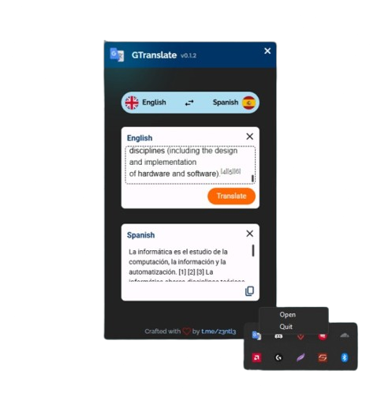

<!-- PROJECT LOGO -->
 

  <a href="#">
    
     
  </a>

  <h3 align="center">GTranslate App</h3>

  

Open-source, modern and convenient cross-platform application for translations at the speed of thought.
     
     
  
  

> [!NOTE]  
> GTranslate will remain in its beta phase until the official release of version ``1.0.0``

# GTranslate

    
#### What's the difference between using this and Google Translator from my browser
GTranslate allows you to perform translations rapidly. It starts automatically when starting your pc/laptop and can be opened directly from the systems tray. Much faster for translations than starting your browser and getting to some translator website and writing it all down. Essentially taking away most of your time trying to get there.

#### Goals
- Translations at the speed of thought

#### Features
- [x] Autostart on boot
- [x] System Tray
- [x] Secure self updater
- [x] Supported on Windows, MacOS and Linux
- [x] Easy setup: platform specific popular installer wizards
- [x] Built with Rust, maximising security and performance
- [x] Uses Tokio for maximum performance
- [x] Easy installation: Bundled using the most popular platform specific installation wizards
- [ ] Keybinds to quickly open (todo)

## Internal crates
- ### Plugins
  - ``tauri-plugin-translator-bindings``
    > Our Tauri plugin providing bindings to ``gtranslate`` crate made by z3ntl3
    >   [Source](https://github.com/Z3NTL3/gtranslate-app/tree/main/plugins/tauri-plugin-translator-bindings/src)
